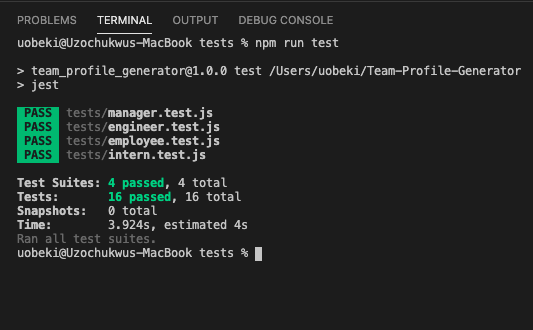

# Team-Profile-Generator

  <br/>


  ## Table of Contents
  * [Task](#task)
  * [Preview](#preview)
  * [Thoughts](#thoughts)
  * [Technologies Used](#technologies)
  * [Links](#links)
  * [Tests](#tests)

## Task :man_technologist:
For this assignment, we were tasked with creating a command line application using Node.js. The purpose of the application is to generate a a team profile page that populates with card displaying information on employees based on user inputs.

The generator can be invoked by using the command: 

```bash
node generator.js
```

Once invoked, the command line will the user ask a series of questions that will inquire (see what I did there?...) about what the user wants included in their page. After the user has inputted the first employee's information, they will be asked if they would like to add another employee. If the user agrees, they will be asked the previous set of questioning once again. 

## Preview


## Thoughts :thinking:
This assignment just continues to prove the muscle that the command line carries. To be able to dynamically update a webpage through the command line is mind boggling considering how we created webpages previously.

## Technologies Used
Languages: HTML, Javascript, Node.js

Packages: Inquirer, util, fs

Frameworks: Bootstrap

## Links
Repo: https://github.com/uzobeki/Team-Profile-Generator <br>
Example Page: https://github.com/uzobeki/Team-Profile-Generator/blob/main/dreamteam.html

## Tests

Several tests were done to ensure the efficiency of the javascript files. 4 test files were created to test the code of the 4 Javascript files needed for this assignment. These files are located within the _tests_ folder. The results of that testing is below.




## Author
Uzochukwu Obeki